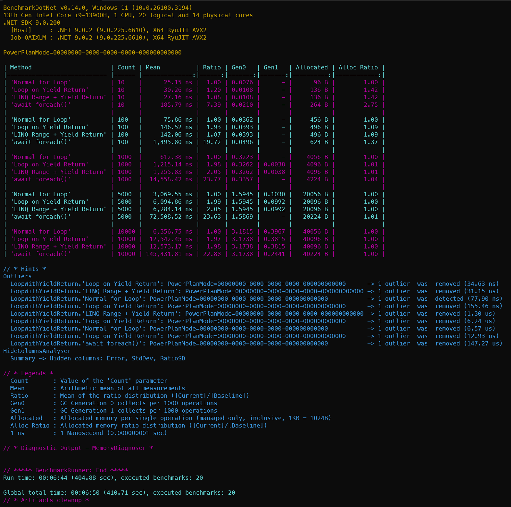

# Yield Return Performance Comparison

This repository contains some performance comparisons on [C# coroutines (`yield return/break`)](https://learn.microsoft.com/en-us/dotnet/csharp/language-reference/statements/yield) style of programming.

## LoopYieldReturnBenchmarks

The console project in the **LoopYieldReturnBenchmarks** folder contains benchmarks between `for`, `yield return`, `awawit forech` loops on providing a countdown integer list.

To run the Benchmark, under the **LoopYieldReturnBenchmarks** folder, execute the following command in terminal:

```
dotnet run -c Release -- --filter '*'
```

The result will be like this:


